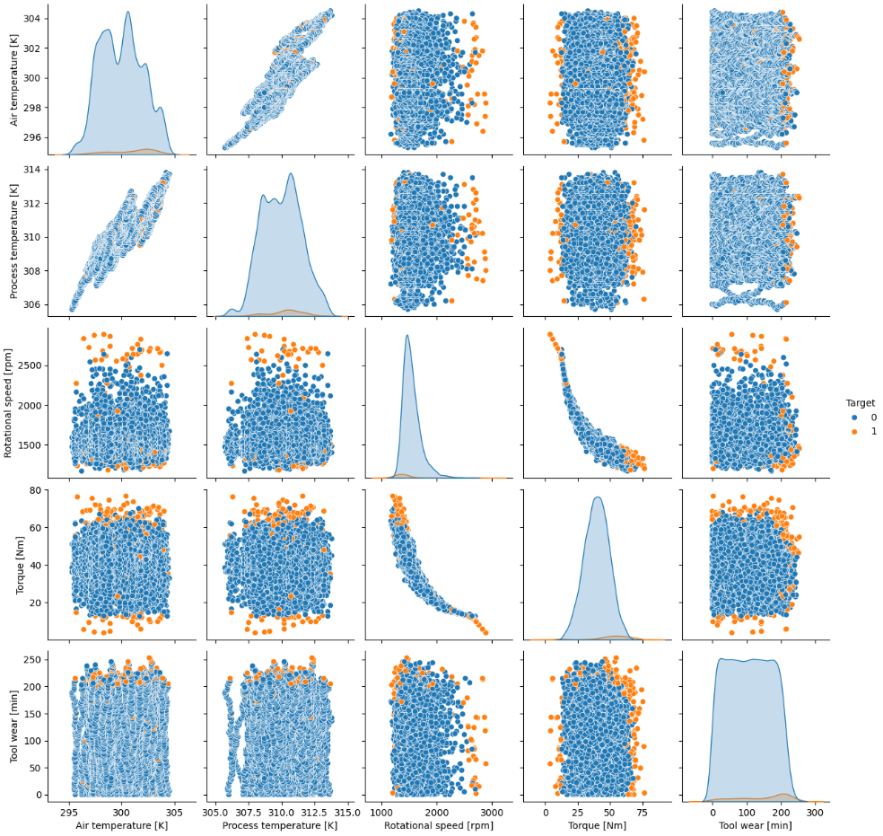
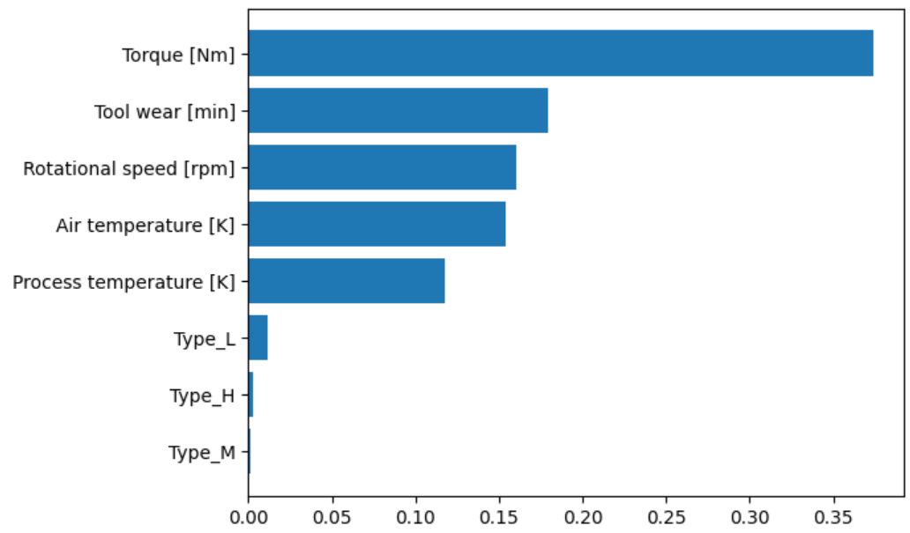

# Machine Predictive Maintenance Classification
***

### Introduction
In a production or manufacturing context, machines are usually a crucial part of the big process, and failure of a machine will cause some disruption. Therefore, it would be very helpful if the failure of a machine can be predicted in advance, so that maintenance work can be done in a shorter time, improving the efficiency of the production.  
This is where **predictive maintenance** comes in, where it uses **historical data** to **identify a pattern** in the machine health, and use it to perform prediction to anticipate problems in advance.  

Here, a sample use case is performed by using a synthetic dataset.  
- A simple **data exploration** is performed on the dataset, in an attempt to find out the impact of existing machine parameters on machine failures. 
- Then, **classification models** are built by using some Machine Learning and Deep Learning algorithms, in order to **predict whether a machine faced failure or not** based on the existing machine parameters. Each model is evaluated based on some metrics, to identify the model that performed the best. 

### Dataset Used
The dataset used is a **synthetic dataset** obtained from the **Kaggle dataset repository**. Link to the dataset is [**here**](https://www.kaggle.com/datasets/stephanmatzka/predictive-maintenance-dataset-ai4i-2020).
The dataset consists of 10,000 data points stored as rows with 14 features in columns:  
- **UID** & **product ID**: unique identifier ranging from 1 to 10000. 
- **Type**: consisting of a letter L, M, or H for low (50% of all products), medium (30%) and high (20%) as product quality variants and a variant-specific serial number. 
- **air temperature [K]**: generated using a random walk process later normalized to a standard deviation of 2 K around 300 K. 
- **process temperature [K]**: generated using a random walk process normalized to a standard deviation of 1 K, added to the air temperature plus 10 K. 
- **rotational speed [rpm]**: calculated from a power of 2860 W, overlaid with a normally distributed noise. 
- **torque [Nm]**: torque values are normally distributed around 40 Nm with a σ = 10 Nm and no negative values. 
- **tool wear [min]**: The quality variants H/M/L add 5/3/2 minutes of tool wear to the used tool in the process. 
- **machine failure**: Indicates whether the machine has failed in this particular datapoint for any of the following failure modes are true.  

### Key Takeaways from Data Exploration
As there are only five numeric columns in the dataset, a **scatterplot matrix** is plotted to illustrate their relationship, with **different colors representing machine failure** (whether that record is a failure or not).  

  

Also, there is a **categorical column (Type)** that may have some relationships with the machine failure column. A **summary table** is created to show the failure rates in **percentages** for each of the product type (L, M and H).  

| Type | Count (Non Failure) | Count (Failure) | Count (Total) | Percentage (Non Failure) | Percentage (Failure) |
|------|---------------------|-----------------|---------------|--------------------------|----------------------|
| L    | 5765                | 235             | 6000          | 96.08%                   | 3.92%                |
| M    | 2914                | 83              | 2997          | 97.23%                   | 2.77%                |
| H    | 982                 | 21              | 1003          | 97.91%                   | 2.09%                |

From the data exploration, here are some key findings regarding the variables: 
1. Correlation among the numeric variables 
- **Air temperature [K]** & **Process temperature [K]** have a strong linear correlation, and
- **Rotational speed [rpm]** & **Torque [Nm]** have a strong correlation that seems slightly non-linear. 
2. Correlation between numeric variables & the Target column  
- Most of the machine failure happened when **Rotational speed [rpm]** are at a **lower** range, and when **Torque [Nm]** & **Tool wear [min]** are at a **higher** range. 
3. Failure rate by Product Type  
- Product **type L** has a slightly **higher failure rate**, and  
- Product **type H** has a slightly **lower failure rate**. 

### Results from Machine Learning and Deep Learning Classification
Classification models have been trained by using two different Machine Learning algorithms (Random Forest and Gradient Boosting) and a Deep Learning algorithm. All these models have also been tuned to get a better performance. 
The following **table summarizes the performances** of the final models trained in the notebooks, measured in **accuracy and [F1 score](https://en.wikipedia.org/wiki/F-score)**.  

| Models               | Accuracy | F1 Score |
|----------------------|----------|----------|
| Random Forest        | 98.28%   | 65.33%   |
| Gradient Boosting    | 98.33%   | 71.49%   |
| Deep Learning Model  | 98.10%   | 60.42%   |

From the summary table, it can be seen that the **Gradient Boosting model** has the **best performance** for both metrics among the few models trained. 
The **feature importance** attribute from the Gradient Boosting model also suggested that the **Torque [Nm]** variable **contributes the most** to the model's prediction algorithm.  

  

### Files 
For more details on how the whole process is performed, feel free to refer to the files in this folder for reference: 
1. 01_data_exploration.ipynb - The Jupyter Notebook file used for Data Exploration purpose. 
2. 02_machine_learning.ipynb - The Jupyter Notebook file used for training Machine Learning models. 
3. 03_deep_learning.ipynb - The Jupyter Notebook file used for training Deep Learning models. 
4. dataset_raw.csv - The dataset downloaded from the Kaggle repository and used in the Jupyter Notebook files. 

