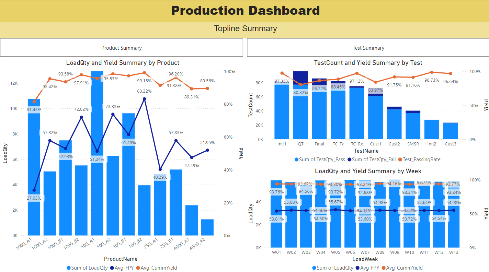
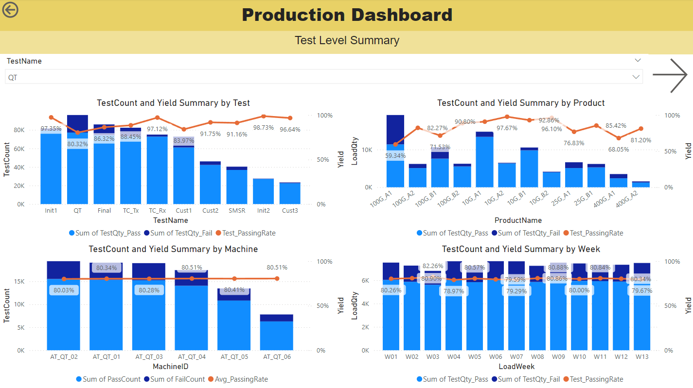
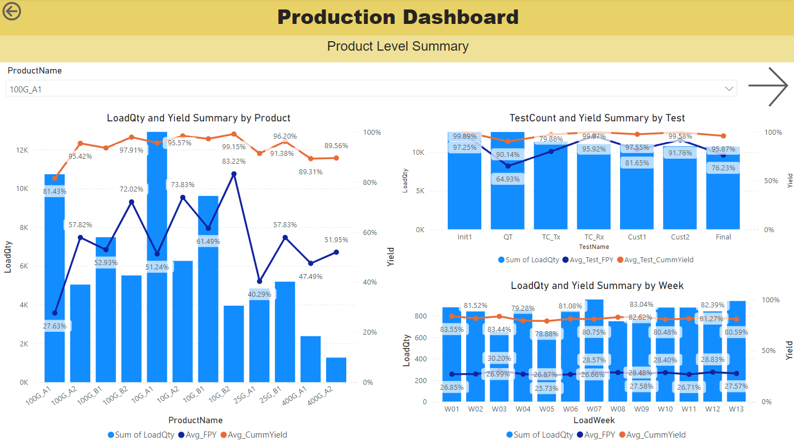
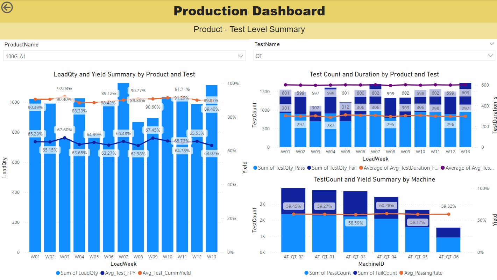

# Production Data Processing and Dashboard
***

### Introduction
This project is a simulation of **a fiber optic manufacturing company that produces optical modules** used for high-bandwidth data communications applications. The production process involves assembly of the optical modules, as well as testing of the modules to ensure that they are functioning according to the specifications. The **company collects various data** throughout the assembly and test processes, and usually **the engineers utilize the data to analyze the performances of their products and test processes**.  

Since **the data is in raw format**, it takes time for the engineers to extract and process the data to perform their analysis. Furthermore, with each product team handling different products and process team handling different test processes, it is not efficient for all the teams to perform separate analysis for their own portfolios.  

Therefore, it would be very helpful if there is a **centralized database that stores processed data** that are commonly used across all the relevant teams. It can be even better if a **centralized dashboard** that uses company-wide defined metrics is made available. This will save a lot of time from each engineer, so that they no longer need to process and analyze their own data, and they can use those time in their other daily works.  

Here, a sample use case is performed to simulate the whole process mentioned above.  
- First, some **synthetic data is generated** with Python to simulate the actual data that is available in the company's production database.  
- Then, assuming that the actual data is already available in an SQL database, an SQL script is used to **process the raw data** and updates the summary data in a few separate table in the same database.  
- Finally, a **dashboard** is created with Power BI, for the engineers to **analyze and monitor the performance of their products and test processes** on the same platform. 

### Synthetic Data Generation 
As real-world data for optical modules are usually confidential and difficult to obtain, some synthetic data is generated with Python instead. For this use case, the focus is on module test process only and not on the assembly process.  
The synthetic data assumes the following module test process:  
- Each module goes through a set list of tests in sequence, according to their product category. If the module passes the first test, it will move on to the next test.  
- If the module fails a test, it is allowed to perform retest after a short interval, up to a maximum of 2 retests (means 3 tests in total). 
- If the module fails the same test for 3 times, the module is considered as not meeting the specification and will be disposed, and therefore, it will not proceed to the following tests. 

The generated dataset consists of around 600k test records with 7 columns:  
- **SerialNum**: Unique identifier for each module, starting with an alphabet and followed by 6 rolling digits. 
- **ProductName**: Product category that the module belongs to. For this use case, 12 products with made-up names are used. 
- **TestName**: The name of the module test process that the specific module went through. For this use case, 10 test processes with made-up names are used. Note that not all products went through all 10 tests. 
- **MachineID**: The name / ID of the machine used for the test process. 
- **TestTimeStamp**: The exact timestamp when the test process is started. 
- **TestResult**: The result of the test, either PASS or FAIL. 
- **TestDuration_s**: The time taken for the test, in seconds. 

### Data Processing with SQL
Although the synthetic dataset here is generated with Python and exported to Excel / SQL database, for real-world cases, data is usually directly ingested into the company database by their own system, and the actual data size will be much larger than the generated dataset. Therefore, the data processing part is performed by using SQL script, which accesses and output the data into different tables within the same database.  

The summary data is outputted into 3 different tables, which utlize similar metrics at different breakdown levels: 
1. **dbo.summary_machine**: Summary data for the performances of each test machine. 
2. **dbo.summary_prod_test**: Summary data for the performances of each product at each test. 
3. **dbo.summary_prod**: Summary data for the performances of each product in general. 

Here are the key metrics used to monitor the performances of the products, test and machines: 
- **TestCount**: Number of tests performed under the specific Test or MachineID. 
- **PassingRate**: Percentage of tests under the specific Test or MachineID that resulted in PASS. 
- **FirstPassYield**: Percentage of modules that passed the test on the first insertion (without any retest). 
- **CummYield** (Cummulative Yield): Percentage of modules that managed to passed the test, no matter how many insertion(s). 
- **LoadQty**: The quantity of modules within that product category that is first tested within that week.
- **Avg_TestDuration_Pass_s**: Average test duration for tests that resulted in PASS. 
- **Avg_TestDuration_Fail_s**: Average test duration for tests that resulted in FAIL. 

### Dashboard 
There are various tools that can be used to create an interactive dashboard that can connect to various data sources, including SQL databses, and be shared across an organization easily. For ease of illustration, Power BI is used in this case, and it is connected to the summary data that is stored in multiple tabs in Excel.  

The dashboard consists of four pages, providing different level of information based on the requirement of different teams. Buttons on each of the pages allow everyone to navigate to different pages for information that they are interested in. Some of the pages also contain dropdown filters for the users to view the performances of the products or tests of their choice.   
1. **Topline Summary**  
This page is mainly for management teams and team managers to have a view of the overall picture of the production line, across all product lines and test processes.
  

2. **Test Level Summary**  
This page is mainly for test engineers from the process team to monitor the performances of their test processes and machines.
  

3. **Product Level Summary**  
This page is mainly for product engineers from the product team to monitor the performances of their products, overall and across the tests.
  

4. **Product - Test Level Summary**  
This is a more detailed page for anyone who wish to understand more on the performance of the modules on a specific product(s) or test.  
  

### Possible Additions or Enhancements
As this use case is just a simulation of an actual use case, which is usually much more complicated, there may be some processes or components that are frequently seen but is not simulated. Here is a list of some of the features that are not covered at this moment, and may be possibly incorporated in the future. 
- Error codes for tests that resulted in FAIL - to provide more information on the reason that it failed. 
- Module rework process - for modules that failed too many times in the same test, some components may be replaced to fix the functionality, instead of disposing the whole module. 
- Set up yield targets for each product / test process, for the engineers or managements to monitor whether they achieved the targets or not. 

### Files 
For more details on how the whole process is performed, feel free to refer to the files in this folder for reference: 
1. 01_synthetic_data_generation.ipynb - The Jupyter Notebook file used for generating synthetic data. 
2. 02_data_processing.sql - The SQL script (written in T-SQL) used to processes the raw data into summary data in the database.
3. 03_production_data_dashboard.pbix - The Power BI Dashboard file, already included the dataset used, and can be opened with Power BI Desktop. 
4. data_generator.xlsx - An Excel file containing some pre-defined names (ProductName, MachineID and so on) and parameters that add variation to the generated dataset. Also contains a calendar table that is used in both synthetic data generation and the SQL data processing.  
5. generated_raw_data.xlsx - The dataset generated from the Python script. 
6. processed_summary_data.xlsx - The summary data after processing with the SQL script. 

